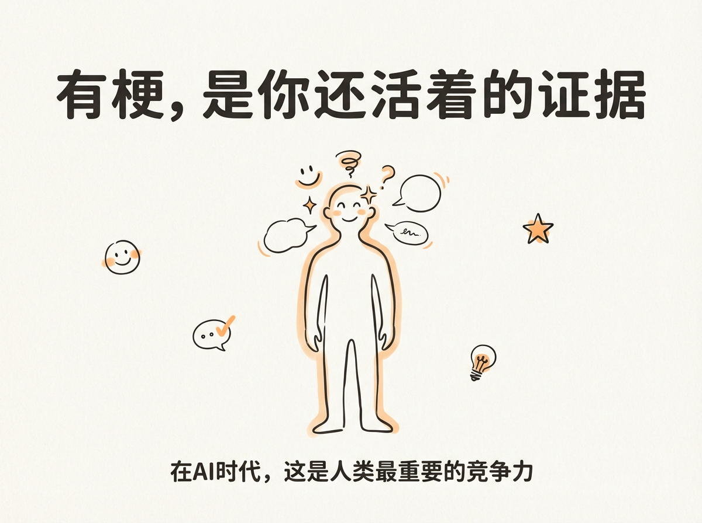
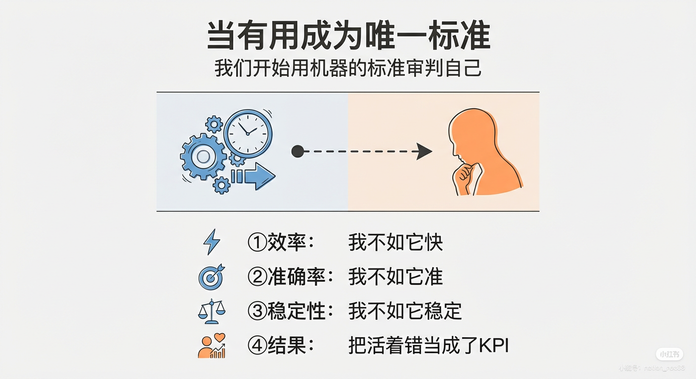
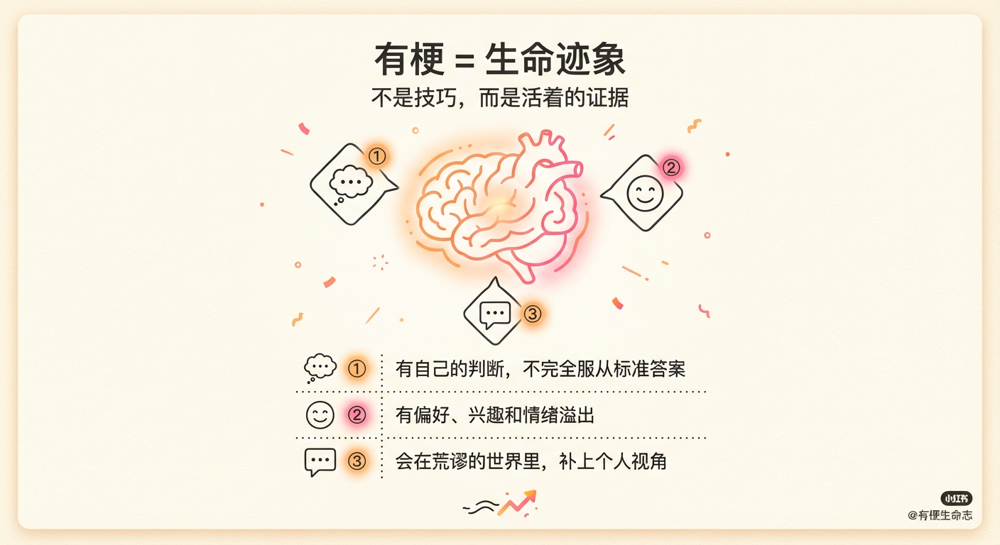
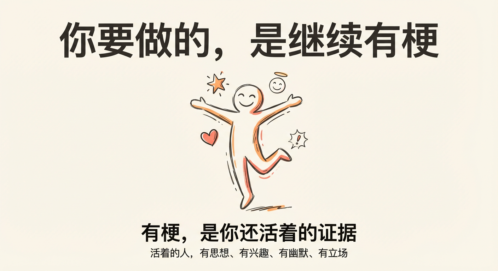

# 有梗，是你还活着的证据

AI 的能力正在以一种不讲武德的方式增长。

写代码、刷数学竞赛、生成文章——速度稳定，负面情绪为零。于是很多人开始认真地想一件事：我的工作，会不会被 AI 替代？

这个问题本身已经很现实了。但真正让人不安的，其实还不是失业。

**而是另一层、更隐蔽的东西。**

---

## 当"有用"成为唯一标准

当 AI 把"有用""高效""正确"这几件事做到极致之后，人开始忍不住继续往下问：

- 那我还剩下什么？
- 我和 AI 还有什么区别？
- 如果我不如它快、不如它准、不如它稳定——那我还算不算一个合格的"存在"？

这时候，人已经不自觉地，**用机器的标准来审判自己了**。

效率、产出、正确率、可替代性。

一旦站上这套坐标系，人类几乎是必输的。因为这根本不是一场比赛——

**这是把"活着"，错当成了一项 KPI。**

---

## 人从来不靠"有用"来证明自己

问题是：人活着的动作，向来都很不讲道理。

- 忍不住脱口吐槽
- 在严肃的评论区，猝不及防丢一句不正经的话
- 明知道没什么用，还是要补充一句"我可能想多了"

这些东西有一个不太严肃、但极其准确的名字：**有梗**。

有梗不是段子技巧，也不是幽默训练。

**有梗是一种生命迹象。**

它意味着：

- 你有自己的判断，不完全服从标准答案
- 你有偏好、兴趣和情绪溢出
- 你会在世界已经足够荒谬的时候，再补上一点个人视角

---

## AI 缺的，恰恰是这些"多余"

AI 不缺能力，缺的正是这些"不该出现"的部分。

它不会忍不住自嘲，不会突然冒犯自己，更不会在逻辑推演至完美后，轻轻补一句：

> "但也可能是我想多了。"

而这些看似"多余"的东西，恰恰是**人类存在的证据**。

---

## 所以，答案是什么？

在 AI 时代，人类还有什么竞争力？

也许答案并不宏大。

不是创造力，不是想象力，甚至不一定是情感。

**而是那种——**

明知道不高效、不严谨、不利于优化，但还是要说出来的冲动。

---

## 有梗，说明你还活着

活着的人，有思想、有兴趣、有幽默、有立场。

而"一个活着的人"，本身就是这个世界**最宝贵、也最不可复制的东西**。

所以当 AI 把所有"正确答案"都说完之后，

你要做的不是焦虑，也不是比拼效率。

**你要做的，是继续有梗。**

因为有梗，不是一种技巧。

**有梗，是你还活着的证据。**

---

## 关于作者

为了成为合格的梗王，我开发了 **[YouGen](https://github.com/your-username/YouGen)** - 一个帮助你在 Twitter 上发现热门推文并生成有梗评论的 AI 工具。

现已开源，欢迎使用！✨

---

**标签**：#AI时代 #深度思考 #有梗 #人工智能 #生活态度 #哲学 #自我价值
