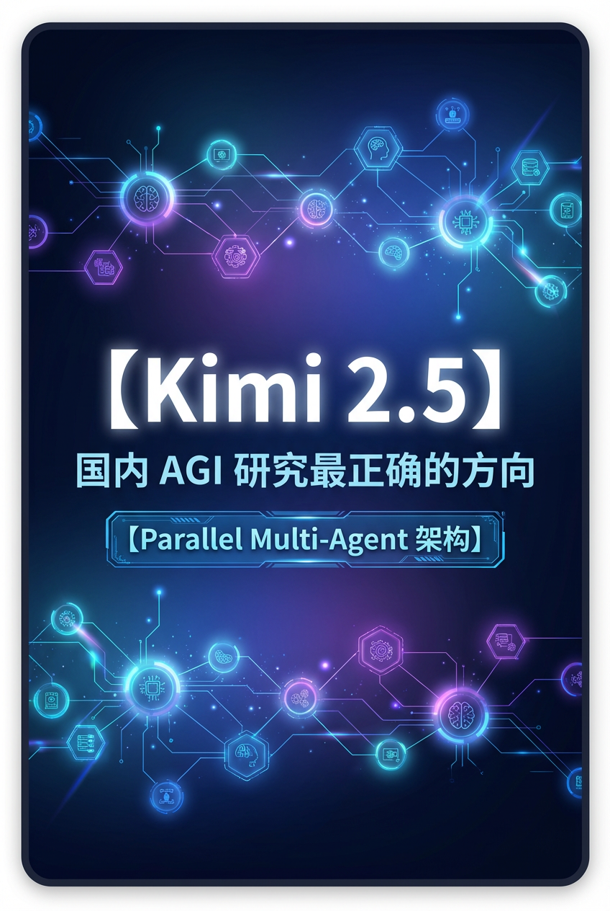
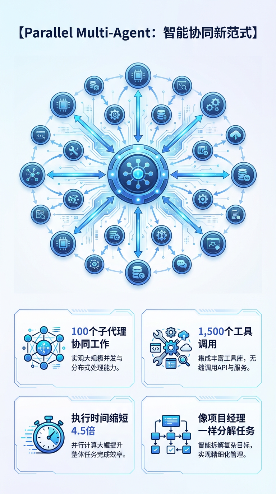
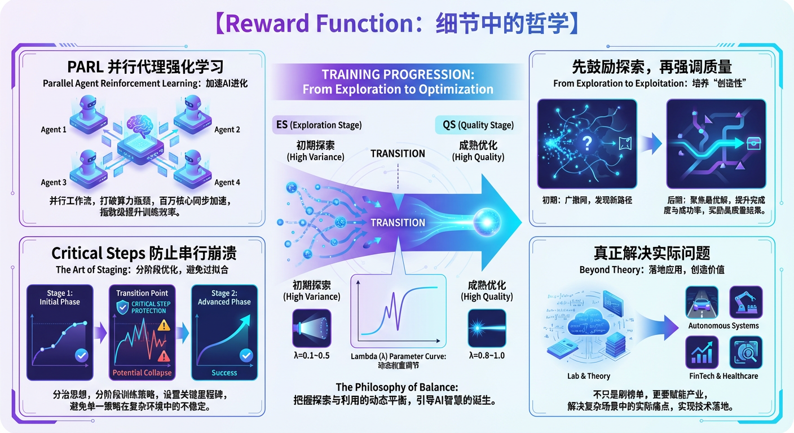
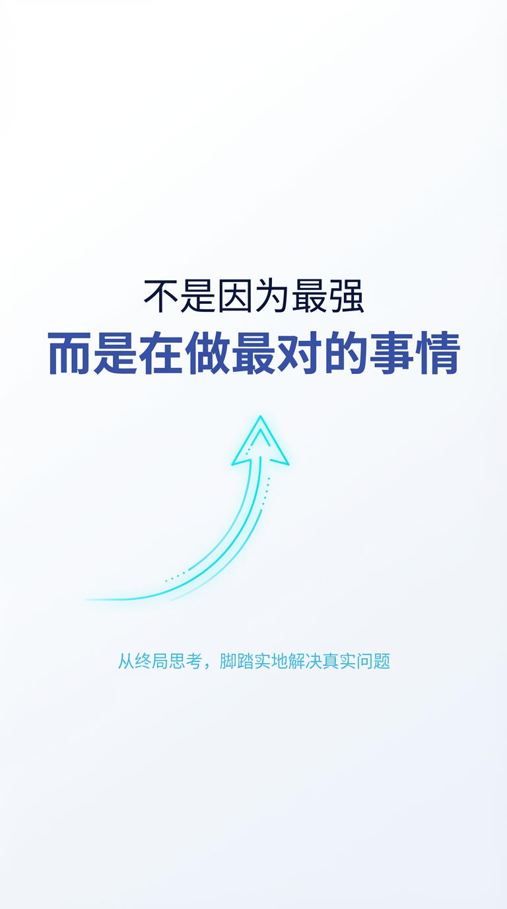

# Kimi 2.5：国内 AGI 研究最正确的方向



当我看到 Kimi 今天发布 2.5 模型的技术报告时，说实话，激动得不行。这不仅仅是因为又一个"更强大"的模型出现了——市面上强大的模型已经够多了。真正让我激动的是，Kimi 团队展现出的研究理念和技术路线，恰好契合了整个行业正在经历的范式转变。

## 从终局思考：什么是 AGI 该有的样子？

大多数 AI 公司在做什么？堆参数、刷榜单、比速度。这些当然重要，但 Kimi 做的不一样。他们一直在从"终局"的角度思考：AGI 应该是什么样的？

真正的 AGI 不应该是一个单一的、即便再强大的模型，而应该是能够像人类组织一样协同工作的智能系统。当你面对一个复杂任务时，你不会一个人从头做到尾——你会分解任务，调用不同的专业能力，并行处理多个子任务。

这个洞察并非 Kimi 独有。事实上，整个 AI 行业正在经历一场深刻的架构转变。Gartner 报告显示，从 2024 年 Q1 到 2025 年 Q2，关于多智能体系统的咨询量激增了 1,445%[1]。2026 年正被称为"多智能体系统之年"[2]，单一全能代理正在被专业化代理团队所取代——就像单体应用让位于微服务架构一样。

而 Kimi 2.5 的核心创新——**Parallel Multi-Agent 架构**——正是这一趋势最先进的实践之一。

## Parallel Multi-Agent：智能协同的新范式

Kimi 2.5 可以自主指挥一个由多达 100 个子代理组成的"智能集群"，在一次执行中调用多达 1,500 个工具调用[3]。更重要的是，这些子代理不是串行执行，而是并行工作。

这意味着什么？

想象你要做一个复杂的数据分析项目。传统的单代理模型会这样做：先读取数据，然后清洗，然后分析，然后可视化，最后写报告——一步一步来。但 Kimi 2.5 会像一个项目经理一样思考：数据清洗和文献调研可以同时进行，不同维度的分析可以分配给不同的子代理并行处理。

结果？执行时间缩短了 **4.5 倍**[3]。

这不是简单的工程优化，这是对"智能应该如何工作"的重新思考。Kimi 实现了一个可训练的编排代理（orchestrator agent），将复杂任务分解为可并行化的子任务——这种"指挥官"模式正是行业领导者们正在采用的方向[4]。



## Reward Function：细节中的哲学

但并行不是目的，解决问题才是。Kimi 团队在设计训练系统时展现出的思考深度，让我看到了什么叫"真的想解决实际问题"。

他们设计了一个叫做 PARL（Parallel-Agent Reinforcement Learning，并行代理强化学习）的训练方法。最精妙的是其 Reward Function 的设计：

```
Rt = λaux(e) · rparallel + (1−λaux(e)) · (I[success]·Q(τ))
```

不要被公式吓到，我来解释它的哲学。

这个公式平衡了两个目标：
1. **rparallel**：鼓励模型探索并行执行的可能性
2. **I[success]·Q(τ)**：确保任务成功完成且质量高

关键在于参数 λaux(e)——它在训练过程中从 0.1 逐渐降到 0。这意味着什么？

在训练初期，模型被鼓励大胆尝试并行化，即使可能失败。随着训练深入，重点逐渐转向任务质量。这就像教孩子学习：先鼓励探索，再强调做好。

更巧妙的是，他们引入了 **Critical Steps** 指标，灵感来自并行计算中的关键路径分析（Critical Path Analysis）[5]——这是一个经典的并行算法设计概念，用于识别任务依赖图中决定最短执行时间的最长路径[6]。

Kimi 用它来测量编排开销加上每个阶段最慢子代理的性能，从而防止模型陷入"串行崩溃"（serial collapse）——表面上分了很多子任务，实际上还是一个接一个执行。在并行计算理论中，关键路径长度决定了程序并行执行的最短时间，平均并发度则是总工作量与关键路径长度的比值[6]。Kimi 将这一经典理论引入 AI 训练，体现了深厚的计算机科学功底。

这种设计不是为了发论文，而是为了真正解决"如何让 AI 学会智能协同"这个根本问题。



## 实际能力：不只是理论上的优雅

理念再好，也要看实际效果。Kimi 2.5 的表现确实令人印象深刻：

**办公生产力场景**[3]
- 在 AI Office Benchmark 上，相比 K2 Thinking 提升了 59.3%
- 在 General Agent Benchmark 上提升 24.3%

**代理搜索任务**[3]
- 在 HLE、BrowseComp、SWE-Verified 等基准上表现强劲
- 关键是：计算成本显著更低

**编程能力**[3]
- 从构建、调试、重构到测试，全面提升
- 能从简单对话直接生成完整的前端界面，包括交互布局和丰富的动画效果
- 支持自主视觉调试：检查自己生成的代码输出，发现问题并独立迭代改进

这些能力不是孤立的功能点，而是 Parallel Multi-Agent 架构带来的涌现能力：当系统学会了智能协同，它在各个需要复杂任务分解的场景中都会表现更好。

## 视觉与多模态：原生能力的体现

Kimi 2.5 是通过对约 15T 的混合视觉和文本 token 进行持续预训练的原生多模态模型[3]。这意味着它不是在语言模型上"贴"一个视觉模块，而是从根本上理解视觉和文本的统一表示。

在图像转代码、视觉调试等任务上的出色表现，证明了多模态能力与 Multi-Agent 架构的完美结合：每个子代理都能同时处理视觉和文本信息，协同完成复杂的多模态任务。

## 为什么说这是"最正确的方向"？

看完 Kimi 2.5 的技术报告，我为什么如此激动？因为我看到了三个关键特质：

### 1. 端到端的系统思维

Kimi 不是在优化局部，而是在重构整个智能系统的工作方式。从架构设计、训练方法到 reward 定义，都体现了对"AGI 应该如何工作"的深度思考。

这与当前的行业趋势高度契合。研究焦点已从"模型能做到这个吗？"转向"如何可靠、安全、大规模地运行这个系统？"[7]，标志着从实验到系统构建的过渡。

### 2. 真实问题导向

无论是借鉴并行算法理论的 Critical Steps 指标防止串行崩溃，还是 reward function 的动态权衡设计，每一个技术细节都在解决实际问题，而不是为了论文指标。

METR 的研究显示，AI 任务持续时间每七个月翻一番，从 2025 年初的一小时任务到 2026 年底的八小时工作流[7]。Kimi 的架构设计正是为了应对这种日益复杂的长时任务挑战。

### 3. 独特的研究风格

在这个人人都在拼参数量、刷 benchmark 的时代，Kimi 坚持走自己的路。他们没有被主流的单模型范式束缚，而是大胆探索 Multi-Agent 协同这个更接近人类智能本质的方向。

Gartner 预测，到 2026 年底，40% 的企业应用将嵌入 AI 代理，而 2025 年这一比例还不到 5%[4]。市场预计将从 78 亿美元飙升至 2030 年的超过 520 亿美元[4]。Kimi 提前布局，占据了先机。

## 使用

Kimi 2.5 可以通过以下方式使用[3]：
- Kimi.com 网页端
- Kimi App
- 官方 API
- Kimi Code（开源 CLI 工具，支持 VSCode、Cursor、Zed 等 IDE 集成）

## 结语

AGI 的道路上，有太多的噪音和短视。但 Kimi 团队展现出的是一种难得的清醒：他们知道自己在往哪里走，为什么这么走，以及如何一步步接近目标。

Kimi 2.5 不是终点，但它确实代表了一个重要的里程碑——证明了 Parallel Multi-Agent 这个方向的可行性和巨大潜力。

这就是为什么我说，Kimi 代表了国内 AGI 研究最正确的方向。不是因为他们最强，而是因为他们在做最对的事情。而且这不是一种孤独的坚持，而是与整个行业最前沿的趋势同频共振。

当我们回望 AGI 的发展历程时，我相信会感谢那些坚持从终局思考、脚踏实地解决真实问题的团队。Kimi，就是其中之一。



---

## 参考文献

[1] [Unlocking the value of multi-agent systems in 2026 | Computer Weekly](https://www.computerweekly.com/opinion/Unlocking-the-value-of-multi-agent-systems-in-2026)

[2] [2026 will be the Year of Multiple AI Agents | RTInsights](https://www.rtinsights.com/if-2025-was-the-year-of-ai-agents-2026-will-be-the-year-of-multi-agent-systems/)

[3] [Kimi K2.5: Technical Overview | Kimi.com](https://www.kimi.com/blog/kimi-k2-5.html)

[4] [7 Agentic AI Trends to Watch in 2026 | Machine Learning Mastery](https://machinelearningmastery.com/7-agentic-ai-trends-to-watch-in-2026/)

[5] [The AI Research Landscape in 2026: From Agentic AI to Embodiment | Adaline Labs](https://labs.adaline.ai/p/the-ai-research-landscape-in-2026)

[6] [Parallel Program Design: Critical Path | McMaster University](http://www.cas.mcmaster.ca/~nedialk/COURSES/4f03/Lectures/algdesign.pdf)

[7] [The Future of AI in 2026: Insights from the Most Important Research of 2025](https://www.foundertofortune.org/p/the-future-of-ai-in-2026-insights)
